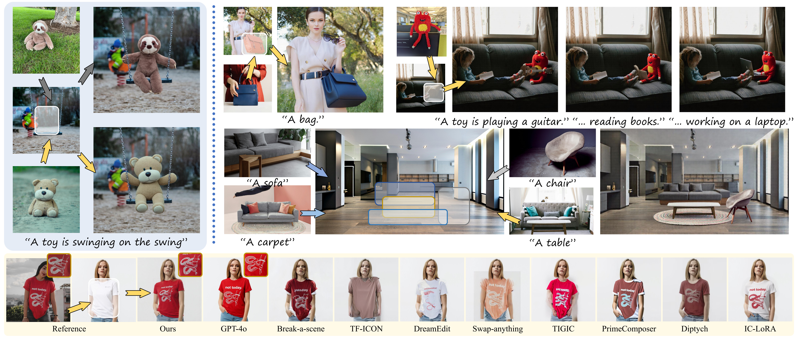

# In-Context Brush: Zero-shot Customized Subject Insertion with Context-Aware Latent Space Manipulation [ACM SIGGRAPH ASIA 2025]

> **In-Context Brush: Zero-shot Customized Subject Insertion with Context-Aware Latent Space Manipulation** 
> Yu Xu1,2, Fan Tang1, You Wu1, Lin Gao1, Oliver Deussen3, Hongbin Yan2, Jintao Li1, Juan Cao1, Tong-Yee Lee4  
> 1Institute of Computing Technology, Chinese Academy of Sciences, 2University of Chinese Academy of Sciences, 3University of Konstanz, 4National Cheng Kung University

 

>**Abstract**:  
>Recent advances in diffusion models have enhanced multimodal-guided visual generation, enabling customized subject insertion that seamlessly "brushes" user-specified objects into a given image guided by textual prompts. However, existing methods often struggle to insert customized subjects with high fidelity and align results with the user's intent through textual prompts. In this work, we propose "In-Context Brush", a zero-shot framework for customized subject insertion by reformulating the task within the paradigm of in-context learning. Without loss of generality, we formulate the object image and the textual prompts as cross-modal demonstrations, and the target image with the masked region as the query. The goal is to inpaint the target image with the subject aligning textual prompts without model tuning. Building upon a pretrained MMDiT-based inpainting network, we perform test-time enhancement via dual-level latent space manipulation: intra-head "latent feature shifting" within each attention head that dynamically shifts attention outputs to reflect the desired subject semantics and inter-head "attention reweighting" across different heads that amplifies prompt controllability through differential attention prioritization. Extensive experiments and applications demonstrate that our approach achieves superior identity preservation, text alignment, and image quality compared to existing state-of-the-art methods, without requiring dedicated training or additional data collection.

## More of our results

