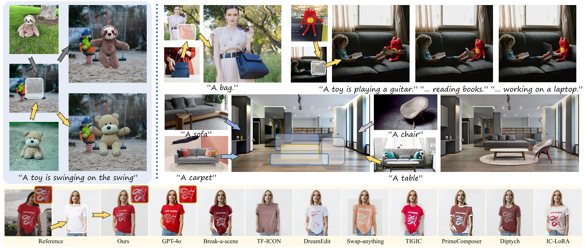

# In-Context Brush: Zero-shot Customized Subject Insertion with Context-Aware Latent Space Manipulation [ACM SIGGRAPH ASIA 2025]

> **In-Context Brush: Zero-shot Customized Subject Insertion with Context-Aware Latent Space Manipulation**<br>
> Yu Xu<sup>1,2</sup>, Fan Tang<sup>1</sup>, You Wu<sup>1</sup>, Lin Gao<sup>1</sup>, Oliver Deussen<sup>3</sup>, Hongbin Yan<sup>2</sup>, Jintao Li<sup>1</sup>, Juan Cao<sup>1</sup>, Tong-Yee Lee<sup>4</sup> <br>
> <sup>1</sup>Institute of Computing Technology, Chinese Academy of Sciences, <sup>2</sup>University of Chinese Academy of Sciences, <sup>3</sup>University of Konstanz, <sup>4</sup>National Cheng Kung University



<a href='https://arxiv.org/abs/2505.20271'></a> 
<a href='https://dl.acm.org/doi/full/10.1145/3757377.3763820'></a>
<a href='https://yuci-gpt.github.io/In-Context-Brush/'></a>


>**Abstract**: <br>
>Recent advances in diffusion models have enhanced multimodal-guided visual generation, enabling customized subject insertion that seamlessly "brushes" user-specified objects into a given image guided by textual prompts. However, existing methods often struggle to insert customized subjects with high fidelity and align results with the user's intent through textual prompts. In this work, we propose "In-Context Brush", a zero-shot framework for customized subject insertion by reformulating the task within the paradigm of in-context learning. Without loss of generality, we formulate the object image and the textual prompts as cross-modal demonstrations, and the target image with the masked region as the query. The goal is to inpaint the target image with the subject aligning textual prompts without model tuning. Building upon a pretrained MMDiT-based inpainting network, we perform test-time enhancement via dual-level latent space manipulation: intra-head "latent feature shifting" within each attention head that dynamically shifts attention outputs to reflect the desired subject semantics and inter-head "attention reweighting" across different heads that amplifies prompt controllability through differential attention prioritization. Extensive experiments and applications demonstrate that our approach achieves superior identity preservation, text alignment, and image quality compared to existing state-of-the-art methods, without requiring dedicated training or additional data collection.

<!-- ## More of our results
 -->
## 🔧 Environment Setup

Our implementation is based on **Diffusers 0.24.0**.  
For reproducibility, we provide a customized version of Diffusers directly in this repository.

### 1. Create Environment

We recommend using **Python 3.9+** with Conda:

```bash
conda create -n incontext_brush python=3.10
conda activate incontext_brush
```
### 2. Install Dependencies

Install the customized Diffusers package from the local path:

```bash
cd diffusers
pip install -e .
```

## 📦 Required Models

Our method relies on **external detection and segmentation models** to localize and extract the customized subject:

- **Grounding-DINO** for object detection  
- **Segment Anything (SAM)** for precise segmentation  

Please place the DINO model (groundingdino_swint_ogc.pth) and SAM model (sam_vit_h_4b8939.pth) in your preferred directories and **update the corresponding model paths in `infer.py`**.

---

## 📁 Input Format

Our method takes **three inputs**:

1. **Subject Image**  
2. **Reference Image**  
3. **Mask JSON file** (specifying the target region)
4. **Prompt** (specifying the target region)

We provide example inputs in the repository:

```text
images/
├── subject/
│   └── example_subject.png
├── reference/
│   └── example_reference.png

input_jsons/
├── example_mask.json
```

The JSON file defines the region to be inpainted. An example can be found in input_jsons/example_mask.json.

## 🚀 Inference

Our approach is **fully training-free** and does not require any finetuning.

To run inference, simply execute:

```bash
python infer.py
```

Before running, please modify the following paths in infer.py according to your local setup:

1. **Diffusion model checkpoint**
2. **Grounding-DINO checkpoint**
3. **SAM checkpoint**
4. **Subject image path**
5. **Reference image path**
6. **Mask JSON path**
7. **Output directory**

Once configured, the script will automatically generate customized subject insertion results.

## 📄 Citation

If you find this work useful, please consider citing:

```bibtex
@inproceedings{xu2025context,
  title     = {In-Context Brush: Zero-shot Customized Subject Insertion with Context-Aware Latent Space Manipulation},
  author    = {Xu, Yu and Tang, Fan and Wu, You and Gao, Lin and Deussen, Oliver and Yan, Hongbin and Li, Jintao and Cao, Juan and Lee, Tong-Yee},
  booktitle = {Proceedings of the SIGGRAPH Asia 2025 Conference Papers},
  pages     = {1--12},
  year      = {2025}
}
```

## 🙏 Acknowledgements

This work is built upon several excellent open-source projects and research efforts. We sincerely thank the authors and contributors for making their work publicly available and for advancing the community:

- **Diffusers**  
  https://github.com/huggingface/diffusers

- **Grounding-DINO**  
  https://github.com/IDEA-Research/GroundingDINO

- **Segment Anything (SAM)**  
  https://github.com/facebookresearch/segment-anything

Their contributions were invaluable to the development of this project.
